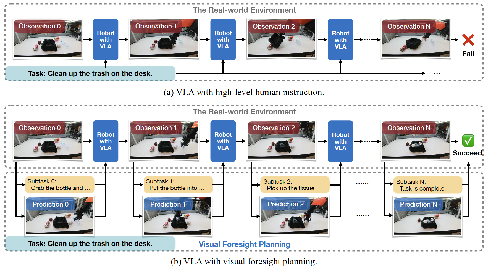

# ForeAct: Steering Your VLA with Efficient Visual Foresight Planning

### [Paper](http://arxiv.org/abs/2602.12322) | [Model](https://huggingface.co/mit-han-lab/foreact-pretrained) | [Real-World Data](https://huggingface.co/datasets/mit-han-lab/ForeActDataset)


## About

- ForeAct is a **visual foresight planner** that empowers VLAs with the ability to **anticipate future observations**, enabling more informed decision-making.
- ForeAct is **general** and **plug-and-play**: state-of-the-art VLAs can seamlessly incorporate ForeAct **without any architectural modification**.
- ForeAct is **highly efficient**, generating a high-fidelity **640 $\times$ 480** future observation in just **0.33s** on a single H100 GPU.

<p align="left">
    
</p>


## Demo

[](https://www.youtube.com/watch?v=VJ72RbSur0Q)

## Usage


### Environment Setup

```bash
git clone https://github.com/mit-han-lab/foreact
cd foreact
bash environment_setup.sh foreact
```

### Finetune

Download the [pretrained weights](https://huggingface.co/mit-han-lab/foreact-pretrained) and prepare your own real-world data (or use our processed [real-world data](https://huggingface.co/datasets/mit-han-lab/ForeActDataset)). Update the relevant paths in `configs/finetune.yaml`, then launch:

```bash
bash scripts/run_finetune.sh
```

### Inference

```bash 
### CLI
python app_cli.py --checkpoint_path path/to/model --prompt "" --input_image path/to/image  --output_dir ./results

### Gradio
python app.py --checkpoint_path path/to/model
```

### VLA Training

We provide examples regarding policy training in [`./third-party/lerobot`](./third-party/lerobot).


### Acknowledgements

Thanks to [metaquery](https://github.com/facebookresearch/metaquery), [diffusers](https://github.com/huggingface/diffusers), [lerobot](https://github.com/huggingface/lerobot) for the wonderful open-source codebase.

<!-- ### Citation
If you find ForeAct useful or relevant to your project and research, please kindly cite our paper:
```bibtex

``` -->
